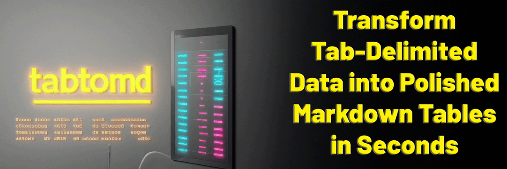

# tabtomd




    [](https://app.codacy.com/gh/pierow2k/tabtomd/dashboard?utm_source=gh&utm_medium=referral&utm_content=&utm_campaign=Badge_grade)


**Transform Tab-Delimited Data into Polished Markdown Tables in Seconds**

`tabtomd` is a powerful and user-friendly command-line tool designed to convert tab-delimited text into Markdown table format. It supports input from either the system clipboard or a specified file and offers flexible options to output the converted table to the terminal or save it to a file.

With features like the optional `--pretty` flag to align table columns, `tabtomd` is perfect for creating polished Markdown tables for documentation, reports, or any structured data presentations.

**You can find more detailed information on the tabtomd website at [https://tabtomd.daspyro.de](https://tabtomd.daspyro.de)**


<!-- TABLE OF CONTENTS -->
<details closed="closed">
  <summary><h2 style="display: inline-block">Table of Contents</h2></summary>
<li><a href="#usage">Usage</a></li>
<li><a href="#commands">Commands</a></li>
<li><a href="#flags">Flags</a></li>
<li><a href="#examples">Examples</a></li>
<li><a href="#installation">Installation</a></li>
<li><a href="#getting-help">Getting Help</a></li>
<li><a href="#contributing">Contributing</a></li>
<li><a href="#license">License</a></li>
</details>

## Usage

```bash
tabtomd [COMMAND] [OPTIONS]
```

### Commands

| Command    | Description                                                |
|------------|------------------------------------------------------------|
| `completion` | Generate an autocompletion script for the specified shell. |
| `file`       | Convert a tab-delimited file to a Markdown table.          |
| `help`       | Display help information for any command.                  |
| `paste`      | Convert tab-delimited data from the system clipboard.      |
| `version`    | Display the `tabtomd` version and build information.       |

### Flags

| Flag                  | Description                                                   |
|-----------------------|---------------------------------------------------------------|
| `--output <file>`     | Save the generated Markdown table to a file.                  |
| `--pretty`            | Align columns in the Markdown table for improved readability. |
| `--print`             | Print the Markdown table to the terminal.                     |

## Examples

### Convert Clipboard Data to Markdown Table

If the clipboard contains:

```text
Name	Species	Gender
Ariel	Mermaid	Female
Sebastian	Crab	Male
Chef Louis	Human	Male
Prince Eric	Human	Male
Ursula	Octopus	Female
```

Run:

```bash
tabtomd paste --print
```

Output:

```markdown
| Name | Species | Gender |
| ----- | ----- | ----- |
| Ariel | Mermaid | Female |
| Sebastian | Crab | Male |
| Chef Louis | Human | Male |
| Prince Eric | Human | Male |
| Ursula | Octopus | Female |
```

### Aligned Markdown Table with `--pretty`

```bash
tabtomd paste --pretty --print
```

Output:

```markdown
| Name        | Species | Gender |
|-------------|---------|--------|
| Ariel       | Mermaid | Female |
| Sebastian   | Crab    | Male   |
| Chef Louis  | Human   | Male   |
| Prince Eric | Human   | Male   |
| Ursula      | Octopus | Female |
```

### Save Markdown Table to a File

```bash
tabtomd paste --output markdown_table.md --pretty
```

### Convert Tab-Delimited File to Markdown Table

#### Print to Terminal
```bash
tabtomd file tsv_file.txt --print
```

#### Save to File with Alignment
```bash
tabtomd file tsv_file.txt --output markdown_table.md --pretty
```

## Installation

### Precompiled Binaries

Precompiled binaries are available for most popular platforms. Visit the
[Releases](https://github.com/pierow2k/tabtomd/releases) page to download the
appropriate binary for your operating system and architecture.

### Install Using `go install`

First, make sure you have [Go](https://golang.org/dl/) installed on your
system.

```bash
go install github.com/pierow2k/tabtomd@latest
```

### Clone and Build

Alternatively, you can clone the repository and build the application manually. Manual
builds also require having [Go](https://golang.org/dl/) installed on your system.

```bash
git clone https://github.com/pierow2k/tabtomd.git
cd tabtomd
go build
```

## Getting Help

Use the `--help` flag or the `help` command for detailed information on each command. For example:

```bash
tabtomd file --help
```

or

```bash
tabtomd help file
```

Have an idea for a new feature or noticed something that isn’t working quite right? [Open an issue](https://github.com/pierow2k/tabtomd/issues) to let us know. Your feedback helps us keep tabtomd reliable and feature-rich.

## Contributing

We welcome contributions! Here's how you can help:

- **Submit a Pull Request**: If you’ve made improvements or fixed a bug, we’d love to see your work. [Submit a pull request](https://www.github.com/pierow2k/tabtomd/pulls) and share your changes with the community.

We appreciate your support and contributions, which drive the continued
growth and success of tabtomd. Thank you for being part of the journey!

## License

`tabtomd` is distributed under the MIT License. See the [LICENSE](LICENSE) file for more details.
