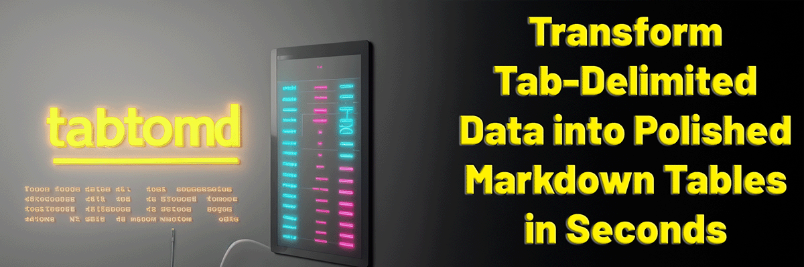

# tabtomd
<!-- markdownlint-disable no-inline-html no-emphasis-as-heading -->



    [](https://app.codacy.com/gh/pierow2k/tabtomd/dashboard?utm_source=gh&utm_medium=referral&utm_content=&utm_campaign=Badge_grade)

**Transform Tab-Delimited Data into Polished Markdown Tables in Seconds**

`tabtomd` is a powerful and user-friendly command-line tool designed to
convert tab-delimited text into Markdown table format. It supports input
from either the system clipboard or a specified file and offers flexible
options to output the converted table to the terminal or save it to a file.

With features like the optional `--pretty` flag to align table columns,
`tabtomd` is perfect for creating polished Markdown tables for
documentation, reports, or any structured data presentations.

**You can find more detailed information on the tabtomd website at
[https://tabtomd.daspyro.de](https://tabtomd.daspyro.de)**

<!-- TABLE OF CONTENTS -->
<details closed="closed">
  <summary><h2 style="display: inline-block">Table of Contents</h2></summary>

- [Usage](#usage)
  - [Flags](#flags)
- [Examples](#examples)
  - [Convert Clipboard Data to Markdown Table](#convert-clipboard-data-to-markdown-table)
  - [Convert Tab-Delimited File to Markdown Table](#convert-tab-delimited-file-to-markdown-table)
  - [Save Markdown Table to a File](#save-markdown-table-to-a-file)
  - [Paste Markdown Table to the Clipboard](#paste-markdown-table-to-the-clipboard)
  - [Suppressing Status Messages](#suppressing-status-messages)
  - [Avoid alignment with the `--no-pretty` flag](#avoid-alignment-with-the---no-pretty-flag)
- [Installation](#installation)
- [License](#license)

</details>

## Usage

```text
tabtomd [flags]
```

### Flags

| Short | Long              | Description                                     |
| ----- | ----------------- | ----------------------------------------------- |
| `-h`  | `--help`          | Show help and usage information                 |
| `-i`  | `--input` string  | Read input from file                            |
| `-n`  | `--no-pretty`     | Disable column alignment (output compact table) |
| `-o`  | `--output` string | Write output to file                            |
| `-p`  | `--paste`         | Paste results to the clipboard                  |
| `-q`  | `--quiet`         | Suppress status messages                        |
| `-v`  | `--version`       | Show version, build details, and license        |

## Examples

### Convert Clipboard Data to Markdown Table

If the clipboard contains tab-delimited data such as this:

```text
Name	Species	Gender
Ariel	Mermaid	Female
Sebastian	Crab	Male
Chef Louis	Human	Male
Prince Eric	Human	Male
Ursula	Octopus	Female
```

Running `tabtomd` without any options produces output like this:

```bash
$ tabtomd
| Name        | Species | Gender |
| ----------- | ------- | ------ |
| Ariel       | Mermaid | Female |
| Sebastian   | Crab    | Male   |
| Chef Louis  | Human   | Male   |
| Prince Eric | Human   | Male   |
| Ursula      | Octopus | Female |
$
```

Which will in turn render Markdown like this:

| Name        | Species | Gender |
| ----------- | ------- | ------ |
| Ariel       | Mermaid | Female |
| Sebastian   | Crab    | Male   |
| Chef Louis  | Human   | Male   |
| Prince Eric | Human   | Male   |
| Ursula      | Octopus | Female |

### Convert Tab-Delimited File to Markdown Table

You can read input from a tab-delimited file using the `--input` flag:

```bash
$ tabtomd --input tsv_file.txt
| Name        | Species | Gender |
| ----------- | ------- | ------ |
| Ariel       | Mermaid | Female |
| Sebastian   | Crab    | Male   |
| Chef Louis  | Human   | Male   |
| Prince Eric | Human   | Male   |
| Ursula      | Octopus | Female |
$
```

### Save Markdown Table to a File

You can specify a file name using the `--output` flag to save the
generated Markdown table to a file:

```bash
$ tabtomd --output markdown_table.md
INFO Markdown table successfully written to markdown_table.md
$
```

### Paste Markdown Table to the Clipboard

You can paste the output of `tabtomd` to the clipboard using the `--paste` flag.

```bash
$ tabtomd --paste
INFO Markdown table copied to clipboard.
$
```

### Suppressing Status Messages

When pasting the output of `tabtomd` to the clipboard or writing output
to a file, log messages are sent to stderr. You can suppress these log
messages using the `--quiet` flag.

```bash
$ tabtomd --quiet --output markdown_table.md
$
```

### Avoid alignment with the `--no-pretty` flag

By default, the columns in the Markdown table are aligned. If you want to
avoid the column alignment, use the `--no-pretty` flag:

```bash
$ tabtomd
| Name | Species | Gender |
| --- | --- | --- |
| Ariel | Mermaid | Female |
| Sebastian | Crab | Male |
| Chef Louis | Human | Male |
| Prince Eric | Human | Male |
| Ursula | Octopus | Female |
$
```

## Installation

Precompiled binaries are available for most popular platforms. Visit the
[Releases](https://github.com/pierow2k/tabtomd/releases) page to download
the appropriate binary for your operating system and architecture.

## License

`tabtomd` is distributed under the MIT License. See the [LICENSE](LICENSE)
file for more details.
